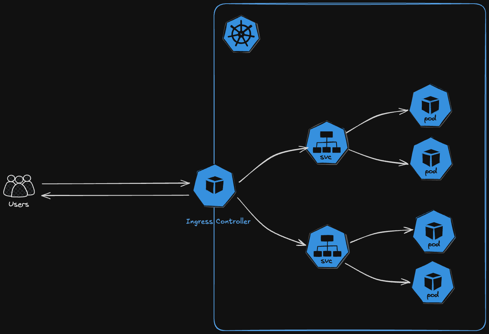

# Expose Your Web Service with Kubernetes: A Comprehensive Ingress Controller Guide

While Pods within a Kubernetes cluster can easily communicate between themselves, they are not by default accessible to external networks and traffic. Therefore you can use an Ingress, which is an API object that shows how traffic from outside of the network should reach internal Kubernetes cluster services that send requests to groups of pods. The Ingress itself has no power. It is a configuration request for the Ingress controller that allows the user to define how external clients are routed to a cluster’s internal services. The Ingress controller hears this request and adjusts its configuration to do what the user asks.
  
In addition, an Ingress controller also come with the additional feature to make it possible to define the TLS configuration used for TLS termination. It acts as a reverse proxy and load balancer. The Ingress controller adds a layer of abstraction to traffic routing, accepting traffic from outside the Kubernetes cluster and load balancing it to Pods inside the cluster. A Kubernetes cluster can have multiple Ingress controllers. When the user creates, updates, or deletes an Ingress, the Ingress controller receives the event and reads the configuration from the Ingress specifications.
  


If that sounds still confusing, don’t worry, it will make more sense after you have setup your first Ingress controller and exposed your service to the public web. And that is exactly what the article is about. 
  
1. First, you will install the NGINX Ingress Controller on your cluster,
2. than create a DNS record for it.
3. After that, you will deploy a basic example service on your cluster,
4. expose it with an Ingress, so you can access it via HTTP.
5. And finally, you configure a TLS encryption with Let’s Encrypt.

## Prerequisites

* Domain
* Running Kubernetes cluster
* Helm https://helm.sh/docs/intro/install/
* Kubectl https://kubernetes.io/docs/tasks/tools/install-kubectl-linux/  

## 1. Nginx Ingress Controller Setup

Download latest helm chart

```bash
helm repo add ingress-nginx https://kubernetes.github.io/ingress-nginx
helm repo update ingress-nginx
```

Install ingress controller:

```bash
helm install ingress-nginx ingress-nginx/ingress-nginx \
 --namespace ingress-nginx \
 --create-namespace
```

Output:
```yaml
NAME: ingress-nginx
LAST DEPLOYED: Wed Jan 22 21:34:22 2025
NAMESPACE: ingress-nginx
STATUS: deployed
REVISION: 1
TEST SUITE: None
NOTES:
The ingress-nginx controller has been installed.
It may take a few minutes for the load balancer IP to be available.
You can watch the status by running 'kubectl get service --namespace ingress-nginx ingress-nginx-controller --output wide --watch'

An example Ingress that makes use of the controller:
  apiVersion: networking.k8s.io/v1
  kind: Ingress
  metadata:
    name: example
    namespace: foo
  spec:
    ingressClassName: nginx
    rules:
      - host: www.example.com
        http:
          paths:
            - pathType: Prefix
              backend:
                service:
                  name: exampleService
                  port:
                    number: 80
              path: /
    # This section is only required if TLS is to be enabled for the Ingress
    tls:
      - hosts:
        - www.example.com
        secretName: example-tls

If TLS is enabled for the Ingress, a Secret containing the certificate and key must also be provided:

  apiVersion: v1
  kind: Secret
  metadata:
    name: example-tls
    namespace: foo
  data:
    tls.crt: <base64 encoded cert>

  type: kubernetes.io/tls


If TLS is enabled for the Ingress, a Secret containing the certificate and key must also be provided:


 apiVersion: v1
 kind: Secret
 metadata:
 name: example-tls
 namespace: foo
 data:
 tls.crt: &ltbase64 encoded cert>
 

 type: kubernetes.io/tls
```

Check the deployment
```bash
kubectl get all —n ingress-nginx
```

Output
```
NAME                                            READY   STATUS    RESTARTS   AGE
pod/ingress-nginx-controller-5c8d66c76d-m4gh2   1/1     Running   0          56m

NAME                                         TYPE           CLUSTER-IP     EXTERNAL-IP       PORT(S)                      AGE
service/ingress-nginx-controller             LoadBalancer   10.225.28.99   183.234.204.126   80:32462/TCP,443:31385/TCP   56m
service/ingress-nginx-controller-admission   ClusterIP      10.225.46.60   <none>            443/TCP                      56m

NAME                                       READY   UP-TO-DATE   AVAILABLE   AGE
deployment.apps/ingress-nginx-controller   1/1     1            1           56m

NAME                                                  DESIRED   CURRENT   READY   AGE
replicaset.apps/ingress-nginx-controller-5c8d66c76d   1         1         1       56m
```

The pod status should be on running and you should see an external-IP address which you will need for the next step.

## 2. Add DNS Record

If the Ingress controller is in place and running, you can continue with creating a DNS record at your domain provider. Therefore, copy your external-ip adderss which you can get here:
```bash
kubectl get svc -n ingress-nginx
```

Output:
```
NAME                                 TYPE           CLUSTER-IP     EXTERNAL-IP       PORT(S)                      AGE
ingress-nginx-controller             LoadBalancer   10.225.28.99     183.234.204.126   80:31326/TCP,443:31881/TCP   5m36s
ingress-nginx-controller-admission   ClusterIP      10.225.46.60   <none>            443/TCP                      5m36s
```
Use external IP-address: 183.234.204.126
 


Go to your domain provider and create a new DNS record with the external-IP as the target and the value should be example. With that you will reach your exposed service at example.<your-domain>.

## 3. Deploy a Kubernetes Service

We will need an example service which will be exposed, use the simple nginx application for it. It is a straight forward static website and the Helm chart for it is provided by bitami. Add the Bitnami Helm chart repository to your Helm client with the following command:

```bash
helm repo add bitnami https://charts.bitnami.com/bitnami
helm repo update
```
Customize the default settings, we will only disable the LoadBalancer which will be deployed on default, as we will use our own Ingress Controller with our already existing LoadBalancer. Therefore, create a file called **values_example_service.yaml** with the following content:
```yaml
service:
  type: ClusterIP
```

install the Helm chart
```bash
helm install my-nginx bitnami/nginx -n nginx —create-namespace -f values_example_service.yaml
```

check it‘s health
```bash
kubectl get pods -n nginx
```

Wait till the pod status reaches running.

### 4. Create the Ingress for the Deployed Service

We have now the Ingress controller setup and running, a DNS record which is routing to the external IP address of the cluster and a running web service inside the cluster. To tell the Ingress controller how the incoming request should be routed, which is in our case to the deployed web service, we need to create an Ingress ressource. So create a file called **ingress_example.yaml** and paste in the following configuration, make sure to adjust the host with your own domain!

```yaml
apiVersion: networking.k8s.io/v1
kind: Ingress
metadata:
  name: ingress-nginx
  namespace: nginx
spec:
  ingressClassName: nginx
  rules:
    - host: example.<your_domain>
      http:
        paths:
          - path: /
            pathType: Prefix
            backend:
              service:
                name: my-nginx
                port:
                  number: 80
```

```bash
kubectl apply -f ingress_example.yaml
```

Check if it works by opening your browser and navigating to the URL http://example.<your_domain>, it can take sometimes few minutes, so don't stress out if it doesn't work right away.

## 5. Production Ready TLS Certificate with Let‘s Encrypt

We achieved to expose our example web service so far, but most likely you faced a warning in your browser with a security concern. That is because right now the communication is not encrypted. To establish a secure connection we have to configure certificate manager. We will use Let's encrypt for that which is offered by Jetstack. Start again, by adding the repository to your Helm client.

```bash
helm repo add jetstack https://charts.jetstack.io
helm repo update jetstack
```

Create a file called **values_cert_manager.yaml** and paste in the minimal settings.

```yaml
# Starter Kit default values for cert-manager.

# CRDs are required usually
installCRDs: true

# Required only if you want to monitor cert-manager activity
prometheus:
  enabled: false
```    

Go ahead and install it at the namespace cert-manager.
```bash
helm install cert-manager jetstack/cert-manager \
 --namespace cert-manager \
 --create-namespace \
 -f values_cert_manager.yaml
```

Check it's status.

```bash
kubectl get all -n cert-manager
```

Output:

```
NAME                                           READY   STATUS    RESTARTS   AGE
pod/cert-manager-5ffd4f6c89-ckc9n              1/1     Running   0          10m
pod/cert-manager-cainjector-748dc889c5-l4dbv   1/1     Running   0          10m
pod/cert-manager-webhook-5b679f47d6-4xptd      1/1     Running   0          10m

NAME                           TYPE        CLUSTER-IP       EXTERNAL-IP   PORT(S)   AGE
service/cert-manager-webhook   ClusterIP   10.225.207.199   <none>        443/TCP   10m

NAME                                      READY   UP-TO-DATE   AVAILABLE   AGE
deployment.apps/cert-manager              1/1     1            1           10m
deployment.apps/cert-manager-cainjector   1/1     1            1           10m
deployment.apps/cert-manager-webhook      1/1     1            1           10m

NAME                                                 DESIRED   CURRENT   READY   AGE
replicaset.apps/cert-manager-5ffd4f6c89              1         1         1       10m
replicaset.apps/cert-manager-cainjector-748dc889c5   1         1         1       10m
replicaset.apps/cert-manager-webhook-5b679f47d6      1         1         1       10m
```

Next, we need a so called Issuer ressource, which is responsible for creating a valid certificate for our service. Create a file called **issuer_cert_manager.yaml** and paste in the following configuration:

```yaml
---
apiVersion: cert-manager.io/v1
kind: Issuer
metadata:
  name: letsencrypt-nginx
  namespace: nginx
spec:
  acme:
  email: <valid_email_address>
  server: https://acme-v02.api.letsencrypt.org/directory
  privateKeySecretRef:
  name: letsencrypt-nginx
  solvers:
  - http01:
  ingress:
  class: nginx
```

Make sure to change the email address to your own one and check if the namespace is the same as the one of our example web service and the Ingress class aligns with our Ingress ressource. Than deploy it!

```bash
kubectl apply -f issuer_cert_manager.yaml
```

As a last step, we have to update our previously deployed Ingress ressource. We are pointing to our certificate manager and the secret which got created by the certificate manager. Open up the file ingress_example.yaml again and do the adjustments.

```yaml
apiVersion: networking.k8s.io/v1
kind: Ingress
metadata:
  name: ingress-nginx
  namespace: nginx
  annotations:
    cert-manager.io/issuer: letsencrypt-nginx
spec:
  ingressClassName: nginx
  tls:
  - hosts:
    - example.<your_domain>
    secretName: letsencrypt-nginx
  rules:
    - host: example.<your_domain>
      http:
        paths:
          - path: /
            pathType: Prefix
            backend:
              service:
                name: my-nginx
                port:
                  number: 80
```

Deploy the changes.

```bash
kubectl apply -f ingress_example.yaml
```

Check the certiicate status, this can take few minutes to be finished, so don't panic if it doesn't work right away.

```bash
kubectl get certificaterequest -n nginx
```

Wait till approved and ready are on true.

```
NAME                  APPROVED   DENIED   READY   ISSUER              REQUESTER                                         AGE
letsencrypt-nginx-1   True                True    letsencrypt-nginx   system:serviceaccount:cert-manager:cert-manager   5m
```

If that is the case, go back to your browser and try to reach your web service again, but this time with **https://example.<your_domain>**.

By following these steps, you will set up an NGINX Ingress Controller, deploy a service, expose it via an Ingress, and configure TLS with Let's Encrypt. Thank you for sticking with me! I hope it helped and you learned something useful. Please leave a comment to share your thoughts, and feel free to point out parts which you found confusing or topics you would like to know more about.